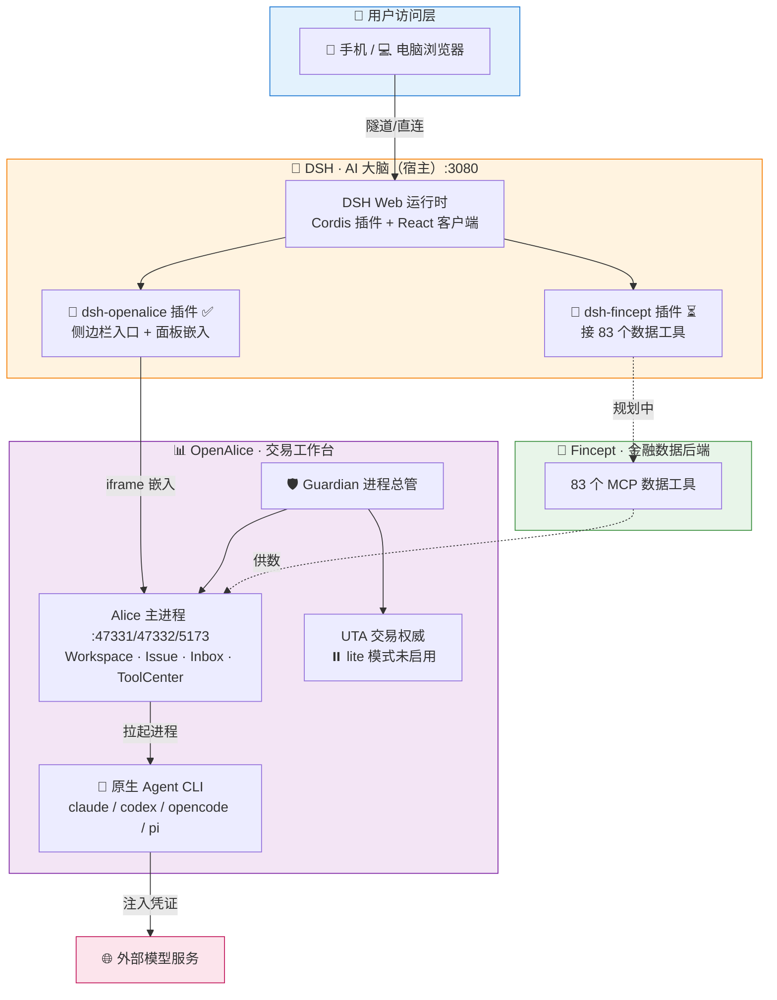
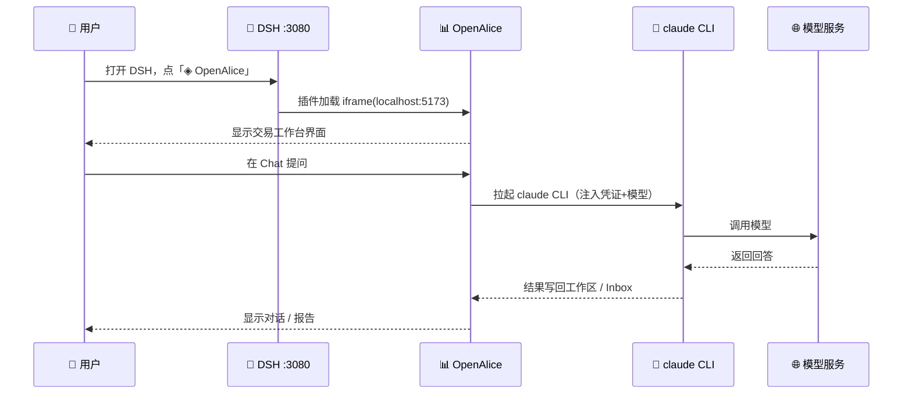

# 三合一资产管理工作台 · 架构图

> **DSH = AI 大脑 · OpenAlice = 交易工作台界面 · Fincept = 金融数据后端**
>
> 以下图表为 Mermaid，可在支持 Mermaid 的前端直接渲染。

---

## 一、整体分层

---

## 二、关键数据流

---

## 三、端口与进程清单

| 组件 | 端口 | 绑定 | 状态 |
|---|---|---|---|
| 🧠 DSH Web | **3080** | 本机 | ✅ |
| 📊 OpenAlice 前端（Vite） | **5173** | 仅 127.0.0.1 | ✅ |
| 📊 OpenAlice 后端 API | **47331** | 仅 127.0.0.1 | ✅ |
| 📊 OpenAlice 工具网关 | **47332** | 仅 127.0.0.1 | ✅ |
| 📊 UTA 交易 | — | — | ⏸️ lite 模式未启用 |

---

## 四、角色分工一句话

| 组件 | 角色 | 负责 |
|---|---|---|
| **DSH** | 大脑 + 宿主 | 想（Agent 推理、任务编排） |
| **OpenAlice** | 工作台界面 | 摆（工作区 / 任务 / 审批 / 报告） |
| **Fincept** | 数据后端 | 喂（行情 / 基本面 / 宏观） |

---

## 五、进度快照

| 项 | 状态 |
|---|---|
| DSH + OpenAlice 运行（已安全加固） | ✅ |
| dsh-openalice 插件（嵌入） | ✅ |
| OpenAlice Chat（claude + grok-4.5） | ✅ 底层已通 |
| **dsh-fincept 数据桥接** | ⏳ 下一步重点 |
| UTA 真交易（接券商） | ⏳ 未启用 |
| 架构方向定稿（DSH 为主） | ⏳ 待确认 |
