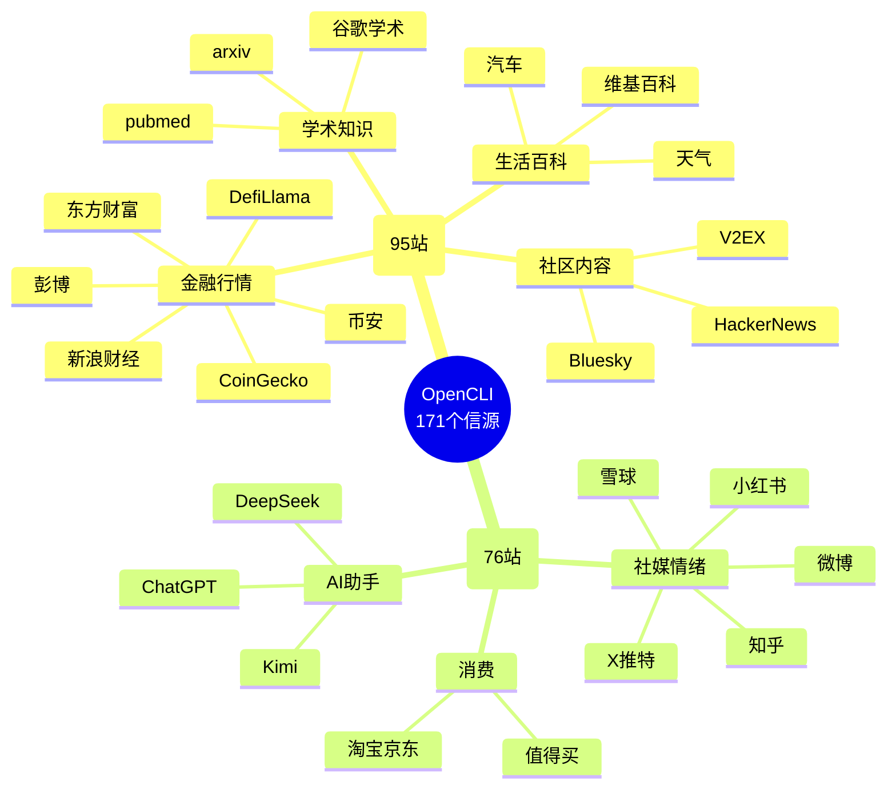

# OpenCLI 功能架构图

## 一、整体架构

```mermaid
flowchart TB
    subgraph USER["👤 你 / DSH Agent"]
        CMD["opencli &lt;站点&gt; &lt;命令&gt;<br/>命令行调用"]
    end

    subgraph CORE["🔧 OpenCLI 核心（服务器上已装 v1.8.7）"]
        DAEMON["Daemon 守护进程<br/>端口 19825 ✅运行中"]
        ROUTER["命令路由器"]
    end

    subgraph PUBLIC["🟢 免登录公开接口（343命令/95站）"]
        P1["东方财富<br/>K线/龙虎榜/北向资金"]
        P2["币安/CoinGecko<br/>加密行情"]
        P3["彭博/BBC<br/>财经新闻"]
        P4["arxiv/pubmed<br/>学术论文"]
        P5["Bluesky/HN<br/>社区内容"]
    end

    subgraph BROWSER["🔴 需浏览器登录接口（957命令）"]
        EXT["Chrome 浏览器插件<br/>Browser Bridge ❌未连接"]
        B1["雪球/微博/知乎"]
        B2["X推特/小红书"]
        B3["值得买/B站"]
    end

    CMD --> DAEMON
    DAEMON --> ROUTER
    ROUTER -->|"公开接口"| PUBLIC
    ROUTER -->|"需登录"| EXT
    EXT -.->|"借用你登录的浏览器"| BROWSER

    PUBLIC -->|"✅ 服务器直接能用"| RESULT["返回数据"]
    BROWSER -.->|"❌ 服务器无浏览器"| NEED["需装你电脑上"]

    style PUBLIC fill:#1a3a2a,stroke:#2d8f5e
    style BROWSER fill:#3a1a1a,stroke:#c0392b
    style EXT fill:#4a3500,stroke:#f39c12
    style NEED fill:#4a3500,stroke:#f39c12
```

## 二、数据流向（接进 DSH 后）

```mermaid
flowchart LR
    subgraph SRC["数据源"]
        FIN["🟢 金融行情"]
        NEWS["🟢 财经资讯"]
        SOC["🔴 社媒情绪"]
    end

    subgraph OPENCLI["OpenCLI"]
        CLI["opencli 命令"]
    end

    subgraph DSH["DSH 金融工作台"]
        MCP["MCP 工具层"]
        AGENT["AI Agent"]
        UI["行情/资讯面板"]
    end

    FIN --> CLI
    NEWS --> CLI
    SOC -.->|你电脑插件| CLI
    CLI --> MCP
    MCP --> AGENT
    AGENT --> UI
    UI -->|手机PWA| ME["📱 你"]

    style SRC fill:#1a2a3a,stroke:#3498db
    style DSH fill:#1a3a2a,stroke:#2d8f5e
    style SOC fill:#3a1a1a,stroke:#c0392b
```

## 三、信源能力分类（171个站点）

```mermaid
mindmap
  root((OpenCLI<br/>171个信源))
    🟢 免登录(95站)
      金融行情
        东方财富
        新浪财经
        币安
        CoinGecko
        DefiLlama
        彭博
      学术知识
        arxiv
        pubmed
        谷歌学术
      社区内容
        Bluesky
        HackerNews
        V2EX
      生活百科
        维基百科
        天气
        汽车
    🔴 需登录(76站)
      社媒情绪
        雪球
        微博
        知乎
        X推特
        小红书
      消费
        值得买
        淘宝京东
      AI助手
        ChatGPT
        DeepSeek
        Kimi
```
